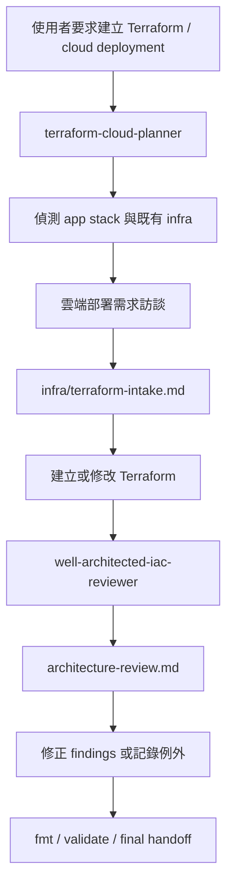

# Cloud Deploy Skill

`cloud_deploy_skill` 是一個 Codex Skill 展示作品，目標是讓 AI 協助產生 AWS Terraform 時，不只是「直接生 IaC」，而是先完成部署規劃，再做部署前的 Well-Architected 風格靜態審查。

本 repo 目前包含兩個互補的 skill：

1. **`terraform-cloud-planner`**：在編輯 Terraform 前，先偵測應用程式 stack、訪談部署需求，並產生標準化 Terraform implementation profile。
2. **`well-architected-iac-reviewer`**：在 Terraform 產生或修改後，於部署前掃描 AWS IaC 風險，輸出 `architecture-review.md`。

整體展示的是一條 AI-assisted IaC workflow：

> 偵測應用程式 stack → 訪談部署需求 → 建立 Terraform 實作規格 → 編輯 Terraform → 執行本機 Well-Architected review gate → 回報風險與驗證證據。

## 為什麼需要這個 skill

直接要求 AI「幫我產生 Terraform」很容易得到看似可用、但實際上缺少脈絡與治理邊界的基礎設施程式碼，例如：

- 沒有確認應用程式語言、框架、runtime port 或部署型態
- 沒有區分 demo、staging、production 的需求差異
- 沒有確認 AWS region、服務清單、成本限制、HA / security 條件
- demo 專案被過度設計成 production-grade 架構
- 缺少 tags、logs、alarms、budget、backup 等基本訊號
- Terraform 產生後沒有 review report 或驗證紀錄

這個 skill package 加入幾個 guardrails：

- **先 intake，再產生 infra**：在 Terraform edits 前先確認 app stack、region、environment、runtime model、sizing、服務、安全、HA、成本限制。
- **區分 demo 與 production**：demo / portfolio 預設低成本、容易 teardown；production 則要求更完整的 HA、安全、備份、監控與成本確認。
- **部署前靜態審查**：用本機 scanner 掃描 Terraform，找出常見 AWS Well-Architected 風險，不需要 AWS credentials，也不會執行 `terraform apply`。
- **留下可審查產物**：輸出 `infra/terraform-intake.md` 與 `architecture-review.md`，方便放進 PR、作品集或面試討論。

## Skill 結構

```text
skill/
├── terraform-cloud-planner/
│   ├── SKILL.md
│   ├── agents/openai.yaml
│   ├── references/aws-question-bank.md
│   └── scripts/detect_stack.py
└── well-architected-iac-reviewer/
    ├── SKILL.md
    ├── agents/openai.yaml
    ├── references/rule-catalog.md
    └── scripts/well_architected_iac_review.py
```

## `terraform-cloud-planner`

當你需要 Codex 建立、修改或 scaffold Terraform / IaC 時，使用這個 skill。

它會強制採用以下流程：

1. 執行 `scripts/detect_stack.py` 偵測目前專案技術棧。
2. 檢查既有 infra hints，例如 `infra/`、`*.tf`、Dockerfile、Compose、CI files。
3. 只詢問必要的部署需求問題。
4. 將決策整理成 `infra/terraform-intake.md`。
5. 在 profile 明確後才編輯 Terraform。
6. 若存在 AWS Terraform，執行 Well-Architected review gate。
7. 可行時執行 `terraform fmt` 與 `terraform validate`。

典型 prompt：

```text
Use terraform-cloud-planner to inspect this app, interview me about AWS deployment requirements, produce the Terraform implementation profile, then create the Terraform files and run the review gate.
```

## `well-architected-iac-reviewer`

當 Terraform 已經產生或修改完成、準備部署前，使用這個 skill 進行本機靜態審查。

這個 scanner 只檢查 Terraform source text。它不會：

- 呼叫 AWS API
- 要求 AWS credentials
- 下載 Terraform providers
- 讀取 Terraform state
- 執行 `terraform plan`
- 執行 `terraform apply`

它會產生 `architecture-review.md`，並把 findings 對應到 AWS Well-Architected pillar：

- Security
- Reliability
- Operational Excellence
- Cost Optimization
- Performance Efficiency

可直接執行：

```bash
python3 skill/well-architected-iac-reviewer/scripts/well_architected_iac_review.py infra \
  --output architecture-review.md \
  --fail-on high
```

建議使用方式：

- `--fail-on none`：只產生 advisory report，不阻擋流程
- `--fail-on high`：適合 demo / portfolio 的部署前 guardrail
- `--fail-on medium`：適合 staging / production 的較嚴格檢查

## 端到端流程



## 目前可偵測的風險範例

| Rule ID | Pillar | 風險範例 |
| --- | --- | --- |
| `SEC-S3-PUBLIC` | Security | S3 bucket ACL 或 policy 讓資料公開。 |
| `SEC-SG-PUBLIC-INGRESS` | Security | Security Group 對 `0.0.0.0/0` 開放 SSH、database、Redis 或 all ports。 |
| `REL-RDS-BACKUP` | Reliability | RDS 沒有設定 backup retention。 |
| `REL-RDS-MULTIAZ` | Reliability | RDS instance 缺少明確 Multi-AZ 訊號。 |
| `OPS-CW-LOGS` / `OPS-CW-ALARMS` | Operational Excellence | Terraform 缺少 CloudWatch logs 或 alarms。 |
| `OPS-TAGS` | Operational Excellence | AWS resources 缺少 ownership / cost allocation tags。 |
| `COST-EC2-OVERSIZED` | Cost Optimization | Demo workload 使用過大的 EC2 instance class。 |
| `COST-BUDGET` | Cost Optimization | Terraform 缺少 AWS Budget resource。 |
| `PERF-SCALING` / `PERF-CACHE` | Performance Efficiency | 有 compute 但缺少 autoscaling 或 cache/read-optimization 訊號。 |

## 與 AWS Well-Architected Tool 的差異

這個 skill package 是早期的 **IaC review gate**。它適合在 PR、demo、portfolio 或 AI-generated infrastructure workflow 裡，於部署前掃描本機 Terraform。

AWS Well-Architected Tool 則是 AWS 官方服務，用來做完整 workload review、lenses、milestones、risk tracking 與 improvement plans。

所以這個 skill **不是取代 AWS Well-Architected Tool**，而是把一部分明顯的 Terraform 風險檢查左移到 IaC authoring 階段。

## 安裝 / 使用方式

將 skill folders 複製到 Codex 可讀取的 skills 目錄，例如：

```bash
mkdir -p ~/.codex/skills
cp -R skill/terraform-cloud-planner ~/.codex/skills/
cp -R skill/well-architected-iac-reviewer ~/.codex/skills/
```

之後可以直接要求 Codex 使用 skill：

```text
Use terraform-cloud-planner to plan AWS Terraform for this app.
```

或：

```text
Use well-architected-iac-reviewer to scan my Terraform and produce architecture-review.md.
```

## 驗證指令

針對這個 skill repo 本身：

```bash
python3 skill/terraform-cloud-planner/scripts/detect_stack.py .
python3 skill/well-architected-iac-reviewer/scripts/well_architected_iac_review.py . --output /tmp/cloud-deploy-review.md --fail-on none
python3 -m py_compile \
  skill/terraform-cloud-planner/scripts/detect_stack.py \
  skill/well-architected-iac-reviewer/scripts/well_architected_iac_review.py
```

針對實際 Terraform target repo：

```bash
terraform fmt -recursive
terraform validate
python3 <path-to-skill>/well-architected-iac-reviewer/scripts/well_architected_iac_review.py <terraform-root> \
  --output architecture-review.md \
  --fail-on high
```

## 安全邊界

- Skill 不會在未明確授權的情況下 apply infrastructure。
- Reviewer 不需要 cloud credentials。
- Findings 是 review prompts，不是完整正式的 AWS Well-Architected Review。
- Production infrastructure 仍應通過正式的 security、compliance、cost 與 operational review。
