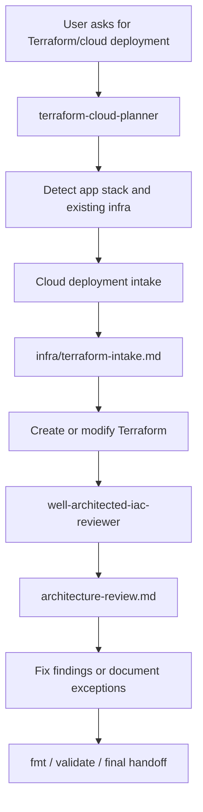

# Cloud Deploy Skill

`cloud_deploy_skill` is a Codex skill showcase for safer AWS Terraform work. It packages two complementary skills:

1. **`terraform-cloud-planner`** — plans cloud deployment before editing Terraform.
2. **`well-architected-iac-reviewer`** — scans generated or existing AWS Terraform for AWS Well-Architected risk signals before deployment.

Together they demonstrate an end-to-end AI-assisted IaC workflow:

> Detect the application stack → interview for deployment requirements → create a Terraform implementation profile → edit Terraform → run a local Well-Architected review gate → report risks and verification evidence.

## Why this exists

Directly asking an AI agent to “create Terraform” often produces infrastructure that is technically plausible but poorly scoped: missing runtime facts, unclear environment goals, expensive defaults, weak network boundaries, no tagging, no logs, no budget, or no review evidence.

This skill package adds guardrails:

- **Intake before infrastructure**: understand app stack, region, environment, runtime model, sizing, services, security, HA, and cost constraints before Terraform edits.
- **Demo vs production separation**: use low-cost, easy-teardown defaults for portfolio/demo work, and require deeper HA/security/backup/observability decisions for production.
- **Static review before handoff**: scan Terraform locally for common AWS Well-Architected issues without AWS credentials or `terraform apply`.
- **Reviewable artifacts**: produce `infra/terraform-intake.md` and `architecture-review.md` so decisions and risks are visible in PRs or portfolio demos.

## Packaged skills

```text
skill/
├── terraform-cloud-planner/
│   ├── SKILL.md
│   ├── agents/openai.yaml
│   ├── references/aws-question-bank.md
│   └── scripts/detect_stack.py
└── well-architected-iac-reviewer/
    ├── SKILL.md
    ├── agents/openai.yaml
    ├── references/rule-catalog.md
    └── scripts/well_architected_iac_review.py
```

### terraform-cloud-planner

Use this when you want Codex to create, modify, or scaffold Terraform/IaC.

It forces this sequence:

1. Run stack detection with `scripts/detect_stack.py`.
2. Inspect existing infra hints such as `infra/`, `*.tf`, Dockerfile, Compose, and CI files.
3. Ask only the required deployment questions.
4. Normalize decisions into `infra/terraform-intake.md`.
5. Edit Terraform only after the profile is clear.
6. Run the Well-Architected review gate when AWS Terraform is present.
7. Run `terraform fmt` and `terraform validate` when possible.

Typical prompt:

```text
Use terraform-cloud-planner to inspect this app, interview me about AWS deployment requirements, produce the Terraform implementation profile, then create the Terraform files and run the review gate.
```

### well-architected-iac-reviewer

Use this after Terraform is created or changed, before deployment/apply, or when you want a local AWS Well-Architected-style IaC review.

The scanner checks Terraform source text only. It does **not** call AWS APIs, require AWS credentials, download providers, inspect state, run `terraform plan`, or run `terraform apply`.

It produces `architecture-review.md` with findings mapped to AWS Well-Architected pillars:

- Security
- Reliability
- Operational Excellence
- Cost Optimization
- Performance Efficiency

Run directly:

```bash
python3 skill/well-architected-iac-reviewer/scripts/well_architected_iac_review.py infra \
  --output architecture-review.md \
  --fail-on high
```

Use `--fail-on none` for advisory reports, `--fail-on high` for demo/portfolio guardrails, and `--fail-on medium` for stricter staging/production gates.

## End-to-end workflow



## Example review findings

The reviewer can flag signals such as:

| Rule ID | Pillar | Example risk |
| --- | --- | --- |
| `SEC-S3-PUBLIC` | Security | S3 bucket ACL or policy exposes data publicly. |
| `SEC-SG-PUBLIC-INGRESS` | Security | Security group opens SSH, database, Redis, or all ports to `0.0.0.0/0`. |
| `REL-RDS-BACKUP` | Reliability | RDS has no backup retention period. |
| `REL-RDS-MULTIAZ` | Reliability | RDS instance lacks explicit Multi-AZ signal. |
| `OPS-CW-LOGS` / `OPS-CW-ALARMS` | Operational Excellence | Terraform lacks CloudWatch logs or alarms. |
| `OPS-TAGS` | Operational Excellence | AWS resources lack tags for ownership/cost allocation. |
| `COST-EC2-OVERSIZED` | Cost Optimization | Demo workload uses very large EC2 instance classes. |
| `COST-BUDGET` | Cost Optimization | Terraform lacks an AWS Budget resource. |
| `PERF-SCALING` / `PERF-CACHE` | Performance Efficiency | Compute exists without autoscaling or cache/read-optimization signal. |

## How this differs from AWS Well-Architected Tool

This package is an early **IaC review gate**. It scans local Terraform before deployment and is useful in PRs, demos, and AI-generated infrastructure workflows.

AWS Well-Architected Tool is the official AWS service for full workload reviews, lenses, milestones, risk tracking, and improvement plans. This package does not replace it; it shifts some obvious checks left into the Terraform authoring process.

## Installation / usage with Codex

Copy or install the skill folders under a Codex-readable skills directory, for example:

```bash
mkdir -p ~/.codex/skills
cp -R skill/terraform-cloud-planner ~/.codex/skills/
cp -R skill/well-architected-iac-reviewer ~/.codex/skills/
```

Then ask Codex to use either skill by name:

```text
Use terraform-cloud-planner to plan AWS Terraform for this app.
```

```text
Use well-architected-iac-reviewer to scan my Terraform and produce architecture-review.md.
```

## Validation commands

For this skill repository itself:

```bash
python3 skill/terraform-cloud-planner/scripts/detect_stack.py .
python3 skill/well-architected-iac-reviewer/scripts/well_architected_iac_review.py . --output /tmp/cloud-deploy-review.md --fail-on none
python3 -m py_compile \
  skill/terraform-cloud-planner/scripts/detect_stack.py \
  skill/well-architected-iac-reviewer/scripts/well_architected_iac_review.py
```

For a Terraform target repository:

```bash
terraform fmt -recursive
terraform validate
python3 <path-to-skill>/well-architected-iac-reviewer/scripts/well_architected_iac_review.py <terraform-root> \
  --output architecture-review.md \
  --fail-on high
```

## Safety notes

- The skills do not apply infrastructure unless the user explicitly asks and valid authority exists.
- The reviewer does not require cloud credentials.
- Findings are review prompts, not a complete formal Well-Architected Review.
- Production infrastructure should still go through normal security, compliance, cost, and operational review processes.
